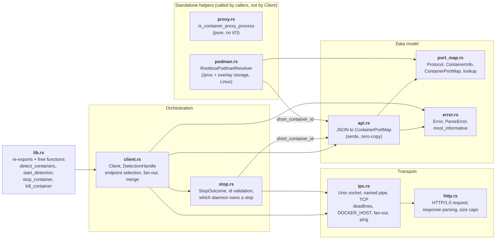
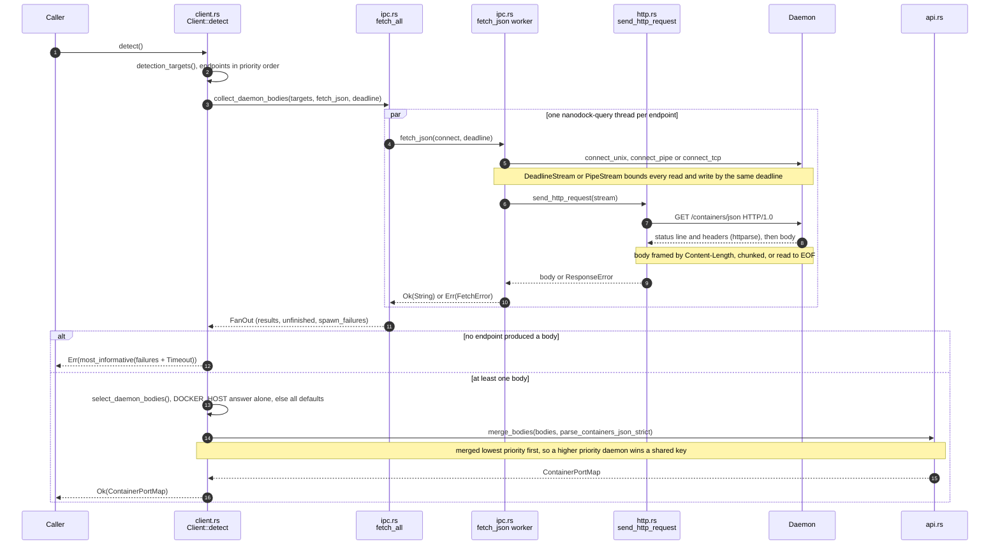
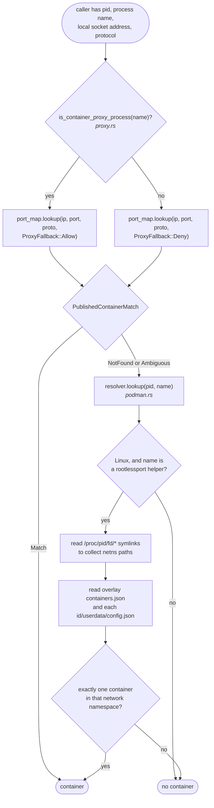
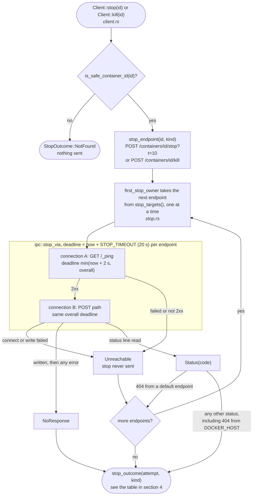
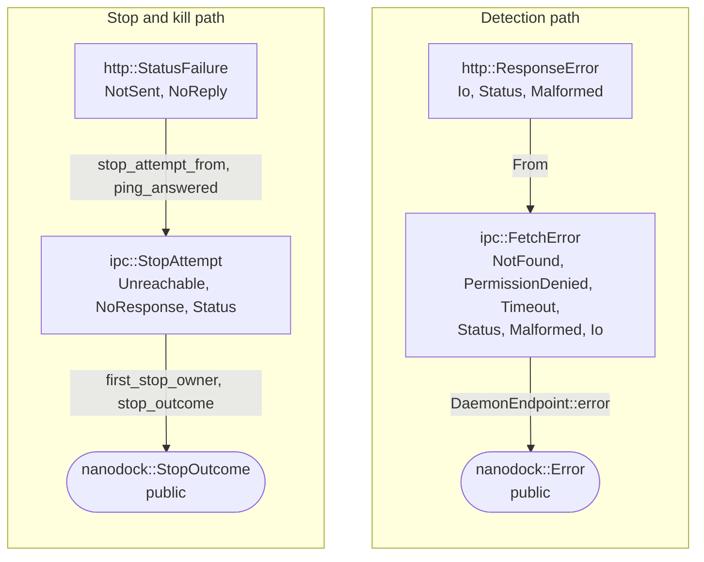

# nanodock architecture

This document explains how nanodock is built: what each module does, how a public call travels down to a socket or named pipe and back, and which rules the code relies on. It is written for a developer who is new to the crate and wants to change it with confidence. It describes the code at version 0.2.0 (`Cargo.toml`).

For the user-facing API, see `README.md` and the rustdoc. For contribution rules and quality gates, see `docs/CONTRIBUTING.md`.

## Contents

1. [What nanodock is](#1-what-nanodock-is)
2. [Big picture](#2-big-picture)
3. [Public API surface](#3-public-api-surface)
4. [Module by module](#4-module-by-module)
5. [Key flows end to end](#5-key-flows-end-to-end)
6. [Transport layer](#6-transport-layer)
7. [Podman, errors, features, and platforms](#7-podman-errors-features-and-platforms)
8. [Testing and benchmarks](#8-testing-and-benchmarks)
9. [Design decisions, invariants, and where to start](#9-design-decisions-invariants-and-where-to-start)

## 1. What nanodock is

nanodock is a small, synchronous Rust library that talks to the Docker and Podman daemons over their HTTP API. It does four things:

- **Detect** which container runtime daemons are running, by probing well-known Unix sockets, Windows named pipes, and an optional `DOCKER_HOST` TCP address.
- **List** running containers and their published ports (`GET /containers/json`), and build a map from `(host_ip, port, protocol)` to the container that publishes it.
- **Recognize** the host-side helper processes (such as `docker-proxy`, `rootlessport`, `wslrelay`) that hold a published port on behalf of a container, and resolve rootless Podman's `rootlessport` back to its container on Linux.
- **Stop or kill** a container through the daemon (`POST /containers/{id}/stop` or `/kill`).

### Design goals

| Goal | How the code meets it |
| ---- | --------------------- |
| Few dependencies | Runtime dependencies are `serde`, `serde_json`, `httparse`, and `log`, plus `libc` on Unix (only for `getuid()`). There is no async runtime, no HTTP client crate, no TLS, and no Windows bindings crate: the few `kernel32` functions the named pipe code needs are declared by hand in `src/ipc.rs`. |
| Synchronous and bounded | Every operation runs on blocking std I/O under an overall deadline. Concurrency, where it exists, is plain `std::thread` plus `std::sync::mpsc`. |
| Hand-rolled HTTP | The daemon API needs only three requests (`GET /containers/json`, `GET /_ping`, `POST .../stop` or `.../kill`), each on its own HTTP/1.0 connection. `src/http.rs` writes fixed request bytes and parses the reply with `httparse`, with hard size caps, which is far smaller than a general HTTP client. |
| Fail safe on stop | A stop or kill is sent to at most one daemon that may act on it. Any doubt about whether a daemon received the request ends the search (`StopOutcome::NoResponse`) instead of trying another daemon that may own a container with the same name. |
| Hostile input tolerated | Daemon replies are size-capped (headers, body, chunk lines, port bindings), container ids are allow-listed before they reach a request path, and Unix sockets owned by other users are skipped. |
| Stable public API | Public enums and `ContainerInfo` are `#[non_exhaustive]`, third-party error types never appear in the API (`ParseError` is opaque), and transport types are private. |

### Who uses it

The main consumer is the `portlens` CLI. It depends on nanodock with the `serde` feature and re-exports it as `portlens::docker`. At the boundary it uses only the public API: it starts `Client::start_detection` while it enumerates sockets, passes `ProxyFallback::Allow` to `ContainerPortMap::lookup` for processes that `is_container_proxy_process` recognizes, falls back to one `RootlessPodmanResolver` per scan for `rootlessport` listeners, reports when `ContainerPortMap::truncated` is set, and calls `Client::stop` or `Client::kill` from its kill command. Nothing in nanodock depends on portlens.

## 2. Big picture

### Modules and their dependencies

All modules are private; `src/lib.rs` re-exports the public items, so every public path is `nanodock::<Item>`.

An arrow means "uses". The re-exports from `lib.rs` are left out; every module except `http.rs` and `ipc.rs` contributes public items.

`proxy.rs` has no dependencies inside the crate, and nothing inside the crate calls it or `podman.rs`: callers combine them with a port map themselves (section 5.3). `ipc.rs` knows nothing about containers; it moves bytes and classifies transport failures, and `client.rs` and `stop.rs` decide what those failures mean.

### Request flow for a detection

`Client::start_detection` runs the same pass on a `nanodock-detect` thread, with the lenient parser, and hands the result back through an `mpsc` channel to a `DetectionHandle`.

## 3. Public API surface

Everything below is re-exported from `src/lib.rs`.

### Types

| Item | Defined in | Contract |
| ---- | ---------- | -------- |
| `Client` | `src/client.rs` | Settings (home directory, detection timeout, `DOCKER_HOST` override) plus the entry points `detect`, `start_detection`, `stop`, `kill`. `Clone`, `Send`, `Sync`, `Default`. `Client::new()` reads `DOCKER_HOST` (ignored when unset, empty, or not UTF-8) and `std::env::home_dir()`, and uses a 3 second timeout. Setters `home`, `timeout` (capped at 24 hours), and `docker_host` chain. |
| `DetectionHandle` | `src/client.rs` | Result of a background detection. `wait()` never fails (empty map on any failure). `wait_result()` returns the `Error`. Both block until the result arrives or until `start + timeout`. |
| `ContainerInfo` | `src/port_map.rs` | `#[non_exhaustive]` struct with public fields `id`, `name`, `image`, `compose_project`, `compose_service`. Built with `ContainerInfo::new(id, name, image)` and `with_compose_project` / `with_compose_service`. `Display` prints `name (image)` or just `name`. |
| `Protocol` | `src/port_map.rs` | `#[non_exhaustive]` enum `Tcp`, `Udp`. Displays as `TCP` / `UDP`. |
| `PortKey` | `src/port_map.rs` | Type alias `(Option<IpAddr>, u16, Protocol)`. `None` is a wildcard host IP. |
| `ContainerPortMap` | `src/port_map.rs` | Map from `PortKey` to `Arc<ContainerInfo>`. `new`, `len`, `is_empty`, `get` (exact key), `insert`, `iter`, `lookup`, `truncated`, plus `FromIterator`, `Extend`, and `IntoIterator for &ContainerPortMap`. |
| `PortMapIter` | `src/port_map.rs` | Iterator over `(PortKey, &ContainerInfo)`; `ExactSizeIterator` and `FusedIterator`. |
| `ProxyFallback` | `src/port_map.rs` | `#[non_exhaustive]` enum `Allow`, `Deny` (default). Whether `lookup` may match on port and protocol alone. |
| `PublishedContainerMatch<'a>` | `src/port_map.rs` | `#[non_exhaustive]` enum `Match(&Arc<ContainerInfo>)`, `NotFound`, `Ambiguous`. `container()` and `container_arc()` return the match, if any. |
| `StopOutcome` | `src/stop.rs` | `#[non_exhaustive]` enum `Stopped`, `AlreadyStopped`, `NotFound`, `Unreachable`, `NoResponse`, `Rejected { status }`. `is_stopped()` is true for the first two. |
| `Error` | `src/error.rs` | `#[non_exhaustive]` enum: `DaemonNotFound`, `PermissionDenied { endpoint }`, `Timeout { endpoint }`, `HttpStatus { status }`, `InvalidResponse { source }`, `Io { source, endpoint }`. Data variants are themselves `#[non_exhaustive]`, so callers match with `..`. |
| `ParseError` | `src/error.rs` | Opaque. Wraps either a `serde_json::Error` (exposed only through `source()`) or a static HTTP framing reason. |
| `RootlessPodmanResolver` | `src/podman.rs` | Caching resolver from a `rootlessport` process id to its container. `new`, `home`, `lookup(pid, name)`, `clear`. Compiles everywhere; `lookup` returns `None` outside Linux. |

### Functions

| Function | Defined in | Contract |
| -------- | ---------- | -------- |
| `detect_containers()` | `src/lib.rs` | `Client::new().detect()`. |
| `start_detection()` | `src/lib.rs` | `Client::new().start_detection()`. |
| `stop_container(id)` | `src/lib.rs` | `Client::new().stop(id)`. |
| `kill_container(id)` | `src/lib.rs` | `Client::new().kill(id)`. |
| `parse_containers_json(body)` | `src/api.rs` | Lenient parse of a `/containers/json` body. Never fails: malformed containers are skipped, non-array input gives an empty map. |
| `parse_containers_json_strict(body)` | `src/api.rs` | Fails with `ParseError` unless the body is a JSON array of well-formed container objects. |
| `short_container_id(id)` | `src/api.rs` | First 12 bytes of `id`, borrowed, or `id` whole when shorter or when byte 12 is inside a multi-byte character. |
| `is_container_proxy_process(name)` | `src/proxy.rs` | Whether a process name is a known container port proxy. |
| `is_podman_rootlessport_process(name)` | `src/podman.rs` | `const fn`; true only for `rootlessport` (ASCII case-insensitive). |

### Two detection paths

| | `Client::detect` (strict) | `Client::start_detection` + `wait` / `wait_result` (best effort) |
| - | ------------------------- | ---------------------------------------------------------------- |
| Thread | Caller's thread (plus one query thread per endpoint) | One `nanodock-detect` thread (plus one query thread per endpoint) |
| Parser | `parse_containers_json_strict`: any used body that is not a container array fails the whole call with `Error::InvalidResponse` | `parse_containers_json`: bad containers or bodies contribute nothing |
| Failure | `Err(Error)` | `wait()` gives an empty map; `wait_result()` gives the `Error`, or `Error::Timeout { endpoint: None }` when the handle's deadline passes first |

## 4. Module by module

### `src/lib.rs`

Crate docs, `mod` declarations, the `pub use` list that forms the public API, and the four free functions. It also includes `README.md` as a doctest (`#[cfg(doctest)] struct ReadmeDoctests`), so README examples must compile. Its only test checks the serde derives round-trip (compiled only with the `serde` feature).

### `src/error.rs`

**Responsibility:** the public error types and the rule for choosing one error when every endpoint failed.

- `Error`: see the table above. `Display` messages name the endpoint when known but never repeat the source's message; the source is available through `std::error::Error::source` (`InvalidResponse` and `Io` only).
- `Error::informativeness()` ranks variants: `DaemonNotFound` 0, `Io` 1, `Timeout` 2, `PermissionDenied` 3, `HttpStatus` 4, `InvalidResponse` 5.
- `most_informative(errors)` (crate-private) returns the highest-ranked error, keeping the earliest on a tie, and `DaemonNotFound` for an empty input. Callers pass errors sorted by endpoint priority, so "earliest" means "highest-priority endpoint".
- `ParseError` wraps a private `ParseErrorKind::{Json(serde_json::Error), Http(&'static str)}`. Constructors `ParseError::json` and `ParseError::http` are `pub(crate)`. `From<ParseError> for Error` produces `InvalidResponse`.

**Does not:** carry HTTP bodies, expose `serde_json` or `httparse` types, or log.

### `src/port_map.rs`

**Responsibility:** the data model for published ports and the socket-to-container matching rules.

- `ContainerPortMap { bindings: HashMap<PortKey, Arc<ContainerInfo>>, truncated: bool }`. Every binding of one container shares one `Arc`, so a 10000-port range costs one pointer per port.
- `lookup(ip, port, proto, fallback)` tries, in order:
  1. the exact key `(Some(ip), port, proto)`;
  2. the wildcard key `(None, port, proto)`;
  3. with `ProxyFallback::Allow` only, `unique_published_container(port, proto)`: scan every binding with that port and protocol; one distinct container (same `Arc`, or equal `ContainerInfo` value) is a `Match`, more than one is `Ambiguous`, none is `NotFound`. With `Deny`, step 3 is `NotFound`.
- `lookup` compares `ip` as given; it does not canonicalize IPv4-mapped IPv6 addresses. Step 3 is a linear scan over all bindings.
- Crate-private helpers used while building maps: `reserve`, `mark_truncated`, and `merge(other)` (moves `other`'s bindings in, replacing equal keys, and ORs the truncated flag).

**Does not:** do any I/O, parse JSON, or know about daemons.

### `src/api.rs`

**Responsibility:** turn a `GET /containers/json` body into a `ContainerPortMap`. Both Docker's format and Podman's libpod format are accepted.

Key items:

- `DockerContainer<'a>`: `Id`, `Names`, `Image`, `Labels`, `Ports`, all optional. Unknown fields are ignored.
- `DockerPort<'a>`: Docker fields `IP`, `PublicPort`, `Type`; libpod's `host_ip` and `protocol` are serde aliases of `IP` and `Type`, while libpod's `host_port` and `range` are separate fields. `host_ports()` returns `(first, last)`: `PublicPort` wins and is always a single port; otherwise `host_port` plus `range` (a `range` of 0 or missing counts as 1, and a range past 65535 stops there). An entry with neither port field (an unpublished `PrivatePort`) is skipped.
- `JsonStr<'a>`: a `Cow<str>` newtype whose visitor borrows from the input when the JSON string has no escapes and allocates only when it does. This keeps the common path zero-copy even inside `Option` and `Vec`.
- `HostIp::{Any, Addr, Unparseable}` from `parse_host_ip`: absent, empty, `0.0.0.0`, or `::` is `Any` (stored as `None`); an IPv6 zone id (`fe80::1%eth0`) is stripped; anything unparseable makes that one binding be skipped, because treating it as a wildcard would misattribute other addresses.
- `parse_port_protocol`: missing means TCP, `tcp`/`udp` match case-insensitively, anything else (for example `sctp`) skips the binding.
- `ComposeLabels` with a hand-written map visitor: only `com.docker.compose.project`, `com.docker.compose.service`, and `io.podman.compose.project` are kept; every other label value is skipped with `IgnoredAny`. `LabelValue` turns a non-string value (number, bool, null, array, object) into `None` instead of failing the container. The project prefers the Docker label, then the Podman one; values are trimmed and empty means `None`.
- `container_display_name`: first non-empty name (trimmed, leading `/` removed), else the image, else `short_container_id(id)`, else `"container"`.
- `populate_port_map(map, containers)`:
  - reserves capacity once, from the sum of all spans, capped at `MAX_PORT_BINDINGS`;
  - skips containers with no `Ports` field;
  - creates one `Arc<ContainerInfo>` per container;
  - keeps a per-container `HashSet` of spans so an entry repeated within one container is expanded and charged once (Docker lists each port for both `0.0.0.0` and `::`, which both become the wildcard key);
  - charges each span against `MAX_PORT_BINDINGS = 2 * 65_536` (131072) for the whole reply; a span that does not fit is skipped and counted, later spans and containers that fit are still inserted;
  - if anything was dropped, calls `mark_truncated()` and logs a `warn!`.
- `parse_containers_json_strict` deserializes `Vec<DockerContainer>` in one pass and maps errors to `ParseError::json`.
- `parse_containers_json` tries the strict parser first (fast path). On failure it parses `Vec<serde_json::Value>` and deserializes each element on its own, dropping the ones that fail; if the body is not a JSON array at all, the map is empty.

**Does not:** do any I/O, validate container ids, or read labels other than the three Compose labels.

### `src/client.rs`

**Responsibility:** the `Client` and `DetectionHandle` types, the list of endpoints to query, the concurrent detection pass, and merging replies. It also hosts the entry points for stop and kill, delegating the logic to `src/stop.rs`.

Key items:

- Constants: `DEFAULT_TIMEOUT` (3 s), `MAX_TIMEOUT` (24 h), `MAX_HANDOFF_MARGIN` (500 ms).
- `query_budget(timeout)`: `timeout` minus a margin of `timeout / 6`, clamped to between 1 ns and 500 ms. The default 3 s timeout gives a 2.5 s query budget. Because the budget is strictly shorter than any nonzero timeout, the detection thread always delivers before `DetectionHandle` stops waiting.
- `DaemonEndpoint` (private enum): `Tcp(String)` always, `Unix(PathBuf)` on Unix, `Pipe(String)` on Windows. Methods: `connect(deadline)` returns a `Box<dyn ipc::Stream>`; `fetch_json(deadline)`; `error(FetchError)` maps transport failures to `Error` with the endpoint's display name; `send_stop(endpoint)`. `Display` is `tcp://host:port`, the socket path, or the pipe path.
- Endpoint selection:
  - `docker_host_tcp_endpoint` and `docker_host_local_endpoint` parse the override through `ipc::docker_host_tcp_addr`, `ipc::docker_host_unix_path` (Unix), or `ipc::docker_host_npipe_path` (Windows).
  - `default_local_endpoints(home)`: on Unix, `ipc::unix_socket_paths(getuid(), home)`; on Windows, `DEFAULT_PIPE_PATHS` (`\\.\pipe\docker_engine`, `\\.\pipe\podman-machine-default`), ignoring `home`.
  - `LOCAL_OVERRIDE_REPLACES_DEFAULTS = cfg!(unix)`: a `unix://` override replaces the default sockets; an `npipe://` override is placed in front of the default pipes.
  - `prioritized_targets(tcp, local_override, replaces, defaults)`: the override first, tagged `true`, then the defaults tagged `false`. A `tcp://` override never replaces the defaults.
  - `detection_targets()` builds this list; `stop_targets()` returns exactly the same list, so a stop never reaches a daemon that detection would not query.
- `collect_daemon_bodies(targets, fetch, deadline)`: runs `fetch` on every target through `ipc::fetch_all`, tags each response with its priority index (so arrival order does not matter), and either returns `select_daemon_bodies(responses)` or, when nothing answered, `most_informative` over the failures (sorted by priority) plus a `Timeout` naming the first endpoint still running. An endpoint whose thread could not start becomes `Error::Io { endpoint: None }`.
- `select_daemon_bodies`: if any `DOCKER_HOST` endpoint answered, only its body is used; otherwise every default endpoint that answered is used, highest priority first.
- `merge_bodies(bodies, parse)`: parses and merges from lowest to highest priority, so the higher-priority daemon wins a shared key. The first parse error ends the merge (strict path). `merge_bodies_lenient` wraps it with `parse_containers_json` and `Infallible`.
- `Client::send_stop(id, kind)`: `is_safe_container_id`, then `stop_endpoint`, then `first_stop_owner(self.stop_targets(), ...)`, then `stop_outcome`.

**Does not:** parse HTTP, open sockets itself, or know the Unix socket path list (that lives in `src/ipc.rs`; only the short Windows list, `DEFAULT_PIPE_PATHS`, is defined here).

### `src/stop.rs`

**Responsibility:** everything about stop and kill that is not transport: id validation, the request path, which daemon's answer counts, and the public `StopOutcome`.

- `StopKind::{Graceful, Kill}` (crate-private).
- `stop_endpoint(id, kind)`: `/containers/{id}/stop?t=10` (the grace period is `ipc::STOP_GRACE_SECS`) or `/containers/{id}/kill`. The id is logged in short form.
- `is_safe_container_id(id)`: allow-list `[A-Za-z0-9][A-Za-z0-9_.-]*`, at most `MAX_CONTAINER_ID_LEN` (256) bytes. This is the name pattern Docker and Podman enforce; hex ids and id prefixes match it too. It keeps `/`, `?`, `#`, `%`, whitespace, control characters, `.`/`..`, and all non-ASCII out of the request line. A rejected id returns `StopOutcome::NotFound` without contacting any daemon.
- `first_stop_owner(endpoints, attempt)`: tries endpoints **sequentially**, in priority order:
  - `Unreachable` (nothing was sent): try the next endpoint;
  - `Status(404)` from a default endpoint: remember it and try the next one (the container may live on another daemon);
  - any other `Status`, any status from the `DOCKER_HOST` endpoint (including 404), or `NoResponse`: stop and return it.
  - At the end it returns the remembered 404, or `Unreachable` if nothing answered.
- `stop_outcome` and `interpret_stop_status` map the result:

| Daemon result | `StopOutcome` |
| ------------- | ------------- |
| 204 | `Stopped` |
| 304 (either kind; only a stop returns it in practice) | `AlreadyStopped` |
| 409 (kill only) | `AlreadyStopped` |
| 404 | `NotFound` |
| any other status (including 409 on a graceful stop) | `Rejected { status }` |
| request written, no usable reply | `NoResponse` |
| no endpoint could be sent the request | `Unreachable` |

**Does not:** open connections (it receives `ipc::StopAttempt` values) or wait for a killed container to disappear: a kill reports `Stopped` once the daemon delivered SIGKILL.

### `src/http.rs`

**Responsibility:** HTTP/1.0 request bytes and response parsing over any blocking `Read + Write` stream. It contains no Docker-specific logic beyond the request constants.

- Requests (all `HTTP/1.0`, `Host: localhost`, no API version prefix, so the daemon uses its own default version and older engines do not answer 400):
  - `CONTAINERS_HTTP_REQUEST`: `GET /containers/json`;
  - `PING_HTTP_REQUEST`: `GET /_ping`;
  - `format_post_request(path)`: `POST {path}`.
- `send_http_request(stream)`: writes the container-list request, reads headers, returns `ResponseError::Status(code)` for non-2xx, else reads the body and checks it is UTF-8.
- `read_response_headers`: reads lines with `read_line_bounded` until the empty line, with the whole header block capped at `MAX_HEADER_SIZE` (64 KiB), then parses with `httparse::Response` using 64 header slots (a reply with more headers fails as malformed). The `BufReader` is left at the first body byte.
- `extract_header_metadata` / `parse_transfer_encoding`: `Content-Length` and `Transfer-Encoding`, case-insensitive. `chunked` (optionally with `identity`) is supported; any other coding, such as `gzip`, is `Unsupported` and rejected.
- Body framing in `read_response_body`:
  - identity with `Content-Length`: `read_exact_body` rejects lengths above `MAX_RESPONSE_BODY` (64 MiB) and starts with at most `INITIAL_BODY_CAPACITY` (64 KiB), growing only as bytes arrive, so a lying header cannot force a large allocation; a short read is `INCOMPLETE_RESPONSE`;
  - identity without length: `read_body_to_eof`, capped at 64 MiB (a `Content-Length` value that does not parse as a number counts as absent, so it lands here);
  - chunked: `read_chunked_body` parses each size line with `httparse::parse_chunk_size` (line capped at `MAX_CHUNK_LINE`, 4 KiB), enforces the cumulative 64 MiB cap with `checked_add`, checks each `\r\n` terminator, and on the zero chunk calls `consume_chunked_trailers`, which reads trailers on a bounded budget and ignores errors because the body is already complete.
- `ResponseError::{Io, Status, Malformed(&'static str)}`: the `Malformed` reasons are static strings (`INCOMPLETE_RESPONSE`, `MALFORMED_HEADERS`, and private ones for chunking, size, encoding, and UTF-8).
- Status-only requests (`send_http_status_request`, `send_http_post_status`) read only the status line and headers and ignore the body. They classify failures as `StatusFailure::NotSent` (writing the request failed) or `StatusFailure::NoReply` (the request was written, then anything went wrong). This split is what makes stop fail closed.

**Does not:** keep connections alive, follow redirects, decompress, speak TLS, or send request bodies.

### `src/ipc.rs`

**Responsibility:** all OS-specific transport code, the overall-deadline machinery, `DOCKER_HOST` parsing, Unix socket discovery, the concurrent fan-out, and the stop transport (ping preflight plus POST). It is the largest module; roughly the first 1300 lines are code and the rest is tests. Section 6 covers it in depth.

Key items: `FetchError`, `DeadlineStream`, `SocketTimeouts`, `PipeStream` (Windows), `connect_unix`, `connect_pipe`, `connect_tcp`, `docker_host_tcp_addr`, `docker_host_unix_path`, `docker_host_npipe_path`, `unix_socket_paths`, `fetch_all`, `spawn_detached`, `fetch_json`, `stop_via`, `StopAttempt`, `STOP_GRACE_SECS`, `STOP_TIMEOUT`.

**Does not:** parse JSON or choose between daemons' answers (that is `client.rs` and `stop.rs`).

### `src/proxy.rs`

**Responsibility:** `is_container_proxy_process(name)`, a pure name check.

- `CONTAINER_PROXY_PROCESSES`: `docker-proxy`, `rootlesskit`, `rootlessport`, `rootlessport-child`, `slirp4netns`, `pasta`, `pasta.avx2`, `com.docker.backend`, `com.docker.vpnkit`, `vpnkit`, `wslrelay`, `gvproxy`, `limactl`.
- `strip_exe_suffix` removes one trailing `.exe` in any case (safely, without splitting a multi-byte character).
- A name matches when it equals a known name ignoring ASCII case, or when `is_truncated_name_of` holds: the name is exactly 15 bytes (Linux `comm`) or 16 bytes (macOS `MAXCOMLEN`) long and is a case-insensitive prefix of a longer known name. Shorter prefixes never match.

**Does not:** recognize generic forwarders such as `ssh` or `socat`, look at process ids, or resolve the container. The caller uses the answer to choose `ProxyFallback::Allow` for `ContainerPortMap::lookup`.

### `src/podman.rs`

**Responsibility:** `RootlessPodmanResolver` and `is_podman_rootlessport_process`. Covered in section 7. It is a standalone helper: `Client` detection never calls it; a caller such as portlens uses it for a `rootlessport` process the port map could not attribute.

## 5. Key flows end to end

### 5.1 Endpoint discovery

`Client::detection_targets()` builds the ordered endpoint list each time it is called (detection and stop both call it; nothing is cached).

1. **`DOCKER_HOST` override** (from `Client::new()` or `Client::docker_host`):
   - `tcp://...` or a value without a scheme: `ipc::docker_host_tcp_addr` normalizes it to `host:port` (see 6.4). It becomes `DaemonEndpoint::Tcp`, tagged `true`, placed first; the defaults follow it.
   - `unix://path` (Unix): `DaemonEndpoint::Unix`, tagged `true`, and the default sockets are dropped. The path is not checked for existence or ownership.
   - `npipe://...` (Windows): accepted only if it names a pipe (`\\host\pipe\name` after turning `/` into `\`); placed first, the default pipes follow.
   - Any other scheme (`ssh://`, `fd://`, `http://`), a malformed address, or the other platform's local scheme: ignored (logged at debug level for unsupported schemes), so only the defaults are used.
2. **Defaults**:
   - Unix: `ipc::unix_socket_paths(uid, home)` takes `unix_socket_candidates` (order below), keeps only paths that exist, drops paths whose canonical form equals an earlier candidate (so a `/var/run/docker.sock` symlink to another runtime's socket is queried once, at the first position), and drops sockets owned by neither `uid` nor root.
   - Windows: the two `DEFAULT_PIPE_PATHS`.

Unix candidate order (`unix_socket_candidates` and `HOME_SOCKET_PATHS` in `src/ipc.rs`):

| # | Path | Notes |
| - | ---- | ----- |
| 1 | `/var/run/docker.sock` | rootful Docker or a runtime's symlink |
| 2 | `$XDG_RUNTIME_DIR/docker.sock` | only if `XDG_RUNTIME_DIR` is absolute |
| 3 | `/run/user/{uid}/docker.sock` | listed once if equal to 2 |
| 4 | `$XDG_RUNTIME_DIR/podman/podman.sock` | |
| 5 | `/run/user/{uid}/podman/podman.sock` | |
| 6 | `/run/podman/podman.sock` | rootful Podman |
| 7 to 17 | `$HOME/` + each entry of `HOME_SOCKET_PATHS` | Docker Desktop (Linux, macOS), Colima (new, old), OrbStack, Rancher Desktop, Lima (two instances), Podman machine (three Podman 4 paths); only when a home directory is set |
| 18 | `$TMPDIR/podman/podman-machine-default-api.sock` | macOS only (`podman_machine_tmpdir`), because `$TMPDIR` is private there and usually shared `/tmp` elsewhere |

### 5.2 Listing containers and port maps

1. `Client::detect()` (or the `nanodock-detect` thread) computes `deadline = started + query_budget(timeout)`.
2. `collect_daemon_bodies` hands every target to `ipc::fetch_all`, which spawns one detached `nanodock-query` thread per target and collects results on an `mpsc` channel until all have reported or the deadline passes. Workers still running at the deadline are abandoned, not joined; their transport deadline bounds them and their late results are dropped with the channel.
3. Each worker runs `DaemonEndpoint::fetch_json`: connect under the deadline, send `GET /containers/json`, read the body. Failures become a public `Error` through `DaemonEndpoint::error`:

| `ipc::FetchError` | Produced when | `Error` |
| ----------------- | ------------- | ------- |
| `NotFound` | connect fails with `NotFound` or `ConnectionRefused` (a stale socket file refuses) | `DaemonNotFound` |
| `PermissionDenied` | connect fails with `PermissionDenied` | `PermissionDenied { endpoint }` |
| `Timeout` | any `TimedOut` or `WouldBlock` during connect or I/O | `Timeout { endpoint: Some(..) }` |
| `Status(code)` | non-2xx reply | `HttpStatus { status }` |
| `Malformed(reason)` | bad framing, caps exceeded, not UTF-8 | `InvalidResponse { source: ParseError::http(reason) }` |
| `Io(error)` | any other I/O error | `Io { source, endpoint: Some(..) }` |

4. With at least one body: `select_daemon_bodies` keeps only the `DOCKER_HOST` body if that endpoint answered, else all answering defaults. A `DOCKER_HOST` daemon that answered with a non-2xx status produced a failure, not a body, so in that case the local daemons are used.
5. `merge_bodies` parses each body (strict or lenient) and merges the maps lowest priority first, so the earlier endpoint wins a key two daemons both publish. The merged map is truncated if any part was.
6. With no body: `most_informative(failures sorted by priority, then a Timeout for the first unfinished endpoint)`. With no targets at all the result is `DaemonNotFound`.

For background detection, `DetectionHandle::wait_result` waits on the channel with `recv_timeout(deadline - now)`, where the handle's deadline is `started + timeout` (later than the query deadline by the margin). A spawn failure for the detection thread is pushed into the channel at once as `Error::Io { endpoint: None }`. If the detection thread ends without sending (for example a panic), the channel disconnects and `wait_result` also returns `Error::Io { endpoint: None }`.

Then the caller uses the map: `get` for an exact key or `lookup` for a local socket address (section 4, `src/port_map.rs`).

### 5.3 Proxy recognition

Two independent helpers, both pure functions of what the caller passes in:

The fallback exists because a proxy such as `docker-proxy` or `rootlessport` may listen on an address that differs from the host IP the daemon reports. Allowing a port-only match for ordinary processes would attribute unrelated listeners to containers, so the caller must opt in per process. The order shown above is how portlens combines them; nanodock itself does not chain these calls.

### 5.4 Stopping or killing a container

Why the ping: an endpoint can accept connections without a working daemon behind it (a forwarder whose backend is down, a TLS port answering plain HTTP with 400, a proxy that wants credentials with 401 or 403). The ping proves a daemon answers before the stop is sent, so skipping a bad endpoint can never cause two daemons to act. Because the ping must be 2xx, a `DOCKER_HOST` daemon that fails it is skipped and the local daemons are tried.

Why `NoResponse` ends the search: once the POST was written, that daemon may be stopping the container. Trying another daemon could stop a different container with the same name.

Timing: each endpoint gets its own 20 second deadline (the 10 second grace period plus a margin). A compile-time assertion in `src/ipc.rs` checks that `PING_TIMEOUT + CONNECT_ATTEMPT_TIMEOUT` fits inside that margin.

## 6. Transport layer

### 6.1 One overall deadline per request

Socket read timeouts in std apply per call, so a daemon that trickles one byte at a time would never trip them. Every transport therefore enforces one `Instant` deadline across all calls:

- `DeadlineStream<S: SocketTimeouts>` wraps `UnixStream` and `TcpStream`. Before every `read` and `write` it computes the time left (`remaining_until`, never zero because std rejects zero timeouts), sets it as the socket timeout, and fails with `io::ErrorKind::TimedOut` once the deadline has passed.
- `PipeStream` gives Windows named pipes the same behavior with overlapped I/O (6.3).
- `is_timeout(kind)` treats both `TimedOut` and `WouldBlock` as a timeout, because an expired socket read timeout surfaces as `WouldBlock` on Unix and `TimedOut` on Windows.

All three transports end up as a plain `Read + Write` value (`ipc::Stream`, boxed by `DaemonEndpoint::connect`), so `src/http.rs` has a single code path.

### 6.2 Unix domain sockets

`connect_unix(path, deadline)` calls `UnixStream::connect` and wraps the stream in `DeadlineStream`. std has no connect timeout for Unix sockets; a local connect completes or fails at once in practice, and the one blocking case (Linux, full listen backlog) is left to the fan-out, which abandons a stuck worker at the deadline.

Discovery and filtering are described in 5.1. The ownership check (`is_owned_by_trusted_user`, `is_trusted_socket_owner`) uses `std::fs::metadata` after following symlinks and `MetadataExt::uid`; `getuid()` comes from `libc`.

### 6.3 Windows named pipes

`connect_pipe(path, deadline)` = `open_named_pipe` + `PipeStream::new`.

- `open_named_pipe` opens the pipe with `OpenOptions` and `FILE_FLAG_OVERLAPPED`. On `ERROR_PIPE_BUSY` it calls `WaitNamedPipeW` with the time left (never past the deadline) and retries. The client end stays in byte read mode even if the server created a message-mode pipe, so reads do not fail with `ERROR_MORE_DATA` for large messages.
- `PipeStream { file, event, deadline }` owns a manual-reset event from `CreateEventW`. `transfer(start)` starts one `ReadFile` or `WriteFile` with an `Overlapped` struct on its own stack, then:
  - immediate completion: read the byte count with `GetOverlappedResult`;
  - `ERROR_IO_PENDING`: `wait_for_event` loops on `WaitForSingleObject` until the event fires or the deadline really passes (it re-checks because the OS may wake a timer tick early);
  - on timeout: `cancel_and_settle` calls `CancelIoEx` and then waits, without a timeout, for the operation to settle, so the kernel never writes into a buffer or `OVERLAPPED` that no longer exists. If data arrived before the cancel took effect, it is returned rather than lost.
  - `ERROR_MORE_DATA` (a message-mode read that filled the buffer) counts as a successful partial read.
- `Read for PipeStream` maps `ERROR_BROKEN_PIPE`, `ERROR_PIPE_NOT_CONNECTED`, and `ERROR_HANDLE_EOF` to EOF (`Ok(0)`). A zero-byte read is also EOF: that is how Docker's message-mode go-winio listener signals that it will write no more.
- `Write for PipeStream` never sends a zero-byte write, which a message-mode server could read as the end of the request.
- `wait_timeout_ms` rounds up and clamps to `1..u32::MAX`, avoiding 0 (`NMPWAIT_USE_DEFAULT_WAIT`) and `u32::MAX` (wait forever).
- The FFI declarations (`WaitNamedPipeW`, `CreateEventW`, `ReadFile`, `WriteFile`, `WaitForSingleObject`, `CancelIoEx`, `GetOverlappedResult`) and the `Overlapped` struct are written by hand in an `unsafe extern "system"` block linked to `kernel32`. Every `unsafe` block carries a `// SAFETY:` comment, which the lints require.

### 6.4 TCP and `DOCKER_HOST`

`docker_host_tcp_addr(value)` follows the Docker CLI's reading of `tcp://` values, plus one leniency (scheme in any letter case):

| Input | Result |
| ----- | ------ |
| `tcp://h:p` | `h:p` |
| `tcp://h` | `h:2375` |
| `tcp://`, `tcp://:2376` | `127.0.0.1:2375`, `127.0.0.1:2376` |
| `tcp://[::1]`, `tcp://[::1]:2376` | `[::1]:2375`, `[::1]:2376` |
| `tcp://h:p/any/path` | `h:p` (path ignored) |
| `h:p`, `h` (no scheme) | read as `tcp://` |
| `tcp://h:` (named host, empty port), bad port, unbracketed IPv6, `C:/x` or `C:\x` | `None` (malformed) |
| `ssh://`, `fd://`, `http://`, other schemes | `None`, logged at debug level |

Note that, following these rules, a scheme-less absolute path such as `/var/run/docker.sock` reads as `127.0.0.1:2375` (the address before the first `/` is empty).

`connect_tcp(addr, deadline)` resolves `addr` with `ToSocketAddrs` (no timeout in std; `DOCKER_HOST` normally names a literal IP or `localhost`) and tries each resolved address with `TcpStream::connect_timeout`, bounded by the time left and by `connect_attempt_cap`: 250 ms for loopback (`LOOPBACK_CONNECT_ATTEMPT_TIMEOUT`, which includes `::ffff:127.0.0.0/104` through `to_canonical`), 3 s otherwise (`CONNECT_ATTEMPT_TIMEOUT`). The loopback cap exists because Windows retries a refused loopback connect for about 2 seconds. A loopback attempt that the cap (not the overall deadline) cut short is reported as `ConnectionRefused` by `loopback_timeout_as_refused`, so a stale `DOCKER_HOST=tcp://127.0.0.1:2375` yields `DaemonNotFound` on Windows as it does on Linux and macOS.

TCP is plain HTTP; there is no TLS support.

### 6.5 Concurrent fan-out

`fetch_all(candidates, fetch, deadline)` (and its testable twin `fetch_all_with`, which takes the spawner) returns `FanOut { results, unfinished, spawn_failures }`. Threads are started with `spawn_detached`, which uses `std::thread::Builder` so a failure to create a thread is an `io::Error` rather than a panic. The collector returns early when every worker has reported (the channel disconnects), and drains anything that arrived right at the deadline with `try_iter`.

### 6.6 Timeouts and caps at a glance

| Constant | Value | Where | Purpose |
| -------- | ----- | ----- | ------- |
| `DEFAULT_TIMEOUT` | 3 s | `src/client.rs` | default detection timeout |
| `MAX_TIMEOUT` | 24 h | `src/client.rs` | cap so deadline arithmetic cannot overflow |
| `MAX_HANDOFF_MARGIN` | 500 ms | `src/client.rs` | most of the timeout kept back for parsing and hand-off |
| `STOP_GRACE_SECS` | 10 | `src/ipc.rs` | `?t=` on a graceful stop |
| `STOP_TIMEOUT` | 20 s | `src/ipc.rs` | deadline for one endpoint's ping plus stop |
| `PING_TIMEOUT` | 2 s | `src/ipc.rs` | ping preflight cap |
| `CONNECT_ATTEMPT_TIMEOUT` | 3 s | `src/ipc.rs` | one TCP connect attempt |
| `LOOPBACK_CONNECT_ATTEMPT_TIMEOUT` | 250 ms | `src/ipc.rs` | one loopback TCP connect attempt |
| `MAX_HEADER_SIZE` | 64 KiB | `src/http.rs` | status line plus headers (also the trailer budget) |
| `MAX_RESPONSE_BODY` | 64 MiB | `src/http.rs` | decoded body |
| `MAX_CHUNK_LINE` | 4 KiB | `src/http.rs` | one chunk-size line |
| `INITIAL_BODY_CAPACITY` | 64 KiB | `src/http.rs` | most a `Content-Length` header can pre-allocate |
| httparse header slots | 64 | `src/http.rs` | most headers per reply |
| `MAX_PORT_BINDINGS` | 131072 | `src/api.rs` | bindings one reply may expand to |
| `MAX_CONTAINER_ID_LEN` | 256 | `src/stop.rs` | longest id a stop or kill accepts |

## 7. Podman, errors, features, and platforms

### 7.1 Podman specifics

Podman shows up in three places:

1. **Endpoints.** Rootless and rootful Podman API sockets, Podman machine sockets on macOS, and the `podman-machine-default` pipe on Windows are ordinary detection and stop targets (5.1). Detection merges a Podman daemon's containers with Docker's, and a stop falls through Docker's 404 to Podman.
2. **Reply format.** `src/api.rs` accepts libpod's port fields (`host_ip`, `host_port`, `range`, `protocol`) as well as Docker's, expands `range`, treats `range: 0` as one port, and reads the `io.podman.compose.project` label as a fallback for the Compose project.
3. **`rootlessport` resolution** (`src/podman.rs`). With rootless Podman, the host port is held by a `rootlessport` process rather than by the container, and its socket address may not line up with the port map. `RootlessPodmanResolver::lookup(pid, name)`:
   - returns `None` unless `cfg!(target_os = "linux")` and `is_podman_rootlessport_process(name)` (this is a runtime `cfg!` branch, so the code still type-checks on every platform);
   - returns the cached answer for `pid` if there is one (including a cached `None`);
   - reads `/proc/<pid>/fd`, follows each fd symlink, and keeps targets whose parent directory is named `netns` and whose file name starts with `netns-` (`read_process_netns_paths`, `is_podman_network_namespace_path`);
   - on first use, loads `containers_by_netns` from each overlay root in `podman_overlay_container_roots`: `$XDG_DATA_HOME/containers/storage/overlay-containers`, `$HOME/.local/share/containers/storage/overlay-containers`, and `/var/lib/containers/storage/overlay-containers`, deduplicated. For each root it reads `containers.json` (id, names, and a metadata string with `image-name` and `name`) and each container's `<id>/userdata/config.json` (the OCI config's `linux.namespaces` entry of type `network`);
   - returns the container only if the process's namespace paths match exactly one distinct container (`match_container_by_netns_paths`); conflicting matches give `None`.

   The resolved `ContainerInfo` has a name (first non-empty name, then the metadata name, then the short id) and image, but no Compose fields. Missing or unreadable files are treated as "no containers", never as errors. The cache is never refreshed on its own, so callers use one resolver per scan or call `clear()`; `home(..)` also clears it.

### 7.2 Error model

There are three error layers, each closer to the caller:

Detection reports an `Error` only when no endpoint produced a body, or, on the strict path, when a body it uses is not a container list; otherwise failures of other endpoints are only logged at debug level. When every endpoint failed, `most_informative` picks the error that tells the caller the most (ranking in 4, `src/error.rs`), so for example a permission problem on `/var/run/docker.sock` is not hidden behind "daemon not found" from the other candidates. Stop and kill never return `Error`; every result, including "nothing could be reached", is a `StopOutcome`.

### 7.3 Feature flags

| Feature | Default | Effect |
| ------- | ------- | ------ |
| `serde` | off | Adds `Serialize` and `Deserialize` derives to `ContainerInfo`, `Protocol`, `StopOutcome`, and `ProxyFallback` through `cfg_attr`. `Protocol` serializes as `"TCP"` / `"UDP"`. The Compose fields of `ContainerInfo` carry `#[serde(default)]`, so records written by 0.1 (without them) still deserialize. |

`serde` and `serde_json` are always dependencies because they parse the daemon's JSON; the feature only adds the derives. docs.rs builds with all features (`[package.metadata.docs.rs]`).

### 7.4 Platform differences

| Aspect | Linux | macOS | Windows |
| ------ | ----- | ----- | ------- |
| Default endpoints | Unix sockets (5.1, rows 1 to 17) | Unix sockets including the `$TMPDIR` Podman 5 socket (row 18) | named pipes `docker_engine`, `podman-machine-default` |
| Home directory | per-user sockets | per-user sockets | ignored |
| Local `DOCKER_HOST` | `unix://` replaces the defaults | same | `npipe://` goes in front of the defaults |
| Socket owner check | yes (current uid or root) | yes | not applicable |
| Transport deadline | `DeadlineStream` | `DeadlineStream` | `PipeStream` (overlapped I/O); `DeadlineStream` for TCP |
| Loopback connect cap | harmless (refusal is immediate) | harmless | needed (refused connect retried for about 2 s) |
| `RootlessPodmanResolver::lookup` | active | always `None` | always `None` |
| Extra dependency | `libc` | `libc` | none (hand-written `kernel32` FFI) |

`DaemonEndpoint`'s local variants and `default_local_endpoints` exist only under `cfg(unix)` and `cfg(windows)`; other targets are not supported. The pure helpers for Unix discovery (`unix_socket_candidates`, `existing_unique_sockets`, `is_trusted_socket_owner`, `HOME_SOCKET_PATHS`) and `is_pipe_path` are compiled with `cfg(any(unix, test))` or `cfg(any(windows, test))`, so their tests run on every host.

## 8. Testing and benchmarks

| Layer | Location | What it covers |
| ----- | -------- | -------------- |
| Unit tests | `#[cfg(test)] mod tests` in every module | Parsing edge cases (`src/api.rs`, `src/http.rs`), merge priority and error selection with fake targets (`FakeTarget` in `src/client.rs`), stop owner rules (`src/stop.rs`), `DOCKER_HOST` parsing, socket ordering and filtering, fan-out behavior, and transport behavior against in-process servers (`src/ipc.rs`) |
| In-process daemons | `src/ipc.rs` tests | `TestDaemon` is a loopback TCP server that records request lines and answers with a `Respond` function, used to prove for example that a stop is never sent when the ping is dropped, times out, or is not 2xx. On Windows, tests create real named pipes with `CreateNamedPipeW` (byte and message mode) to cover EOF, zero-length messages, idle and trickling servers, busy pipes, and blocked writes. On Unix, tests bind real Unix sockets. |
| Property tests | `tests/proptest_parsers.rs` | The JSON parsers never panic on arbitrary bytes or JSON-like strings; strict and lenient agree whenever strict accepts; generated container lists match a model; the lenient parser skips only the malformed container; the port map matches a `HashMap` model; `is_container_proxy_process` and `short_container_id` keep their documented contracts. The file keeps its own `KNOWN_PROXIES` list. |
| Live Docker | `tests/daemon_it.rs` | Opt-in with `NANODOCK_IT=1`. Wildcard and loopback bindings, port ranges, UDP vs TCP, Compose labels (with `tests/fixtures/compose.yaml`), strict vs background agreement, stop/kill outcomes, unknown containers, a `unix://` override to a missing socket. The `tcp_` tests need `NANODOCK_IT_TCP_HOST`. |
| Live rootless Podman | `tests/podman_it.rs` | Opt-in with `NANODOCK_IT_PODMAN=1`. Detection merging Podman and Docker, the `rootlessport` resolver (Linux), and a stop that falls through Docker's 404 to Podman. |
| Shared helpers | `tests/it_support/mod.rs` | `enabled`, `setting`, `port` (read `NANODOCK_IT_*` variables with the CI defaults), a 10 second client, and map query helpers. |
| Doctests | rustdoc examples and `README.md` | Every README example compiles through `ReadmeDoctests`. |

Run the tests with `cargo test --lib --tests --all-features` and `cargo test --doc --all-features`, as CI does. The `[[bench]]` target sets `test = false`, so a bare `cargo test` does not build or run the benchmarks; what it misses without `--all-features` is the serde round-trip test in `src/lib.rs`. Live tests return early unless enabled and should run with `--test-threads=1`.

CI (`.github/workflows/ci.yml`) runs the quality gates on Ubuntu, Windows, and macOS, an MSRV check on Rust 1.89, a package dry run, the `docker-it` and `podman-it` jobs on Linux (the TCP variant puts a socat forwarder in front of the daemon and makes the local socket root-only), a dependency audit, and a benchmark regression job.

**Benchmarks** (`benches/benchmarks.rs`) use Gungraun, which counts instructions under Valgrind, so they run only on Linux (`cargo bench --no-run` compiles them anywhere). They measure `ContainerPortMap::lookup` (exact, wildcard, proxy-unique, and proxy-ambiguous, with 128, 500, and 4096 entries) and `parse_containers_json` (4 to 128 containers). Pull requests fail when instruction counts regress past the configured limit against the merge base.

## 9. Design decisions, invariants, and where to start

### Invariants worth knowing

- **The query budget is shorter than the timeout.** `query_budget(timeout) < timeout` for any nonzero timeout, so the detection thread always hands over what it collected before `DetectionHandle` gives up. Keep this if you touch `client.rs` timing.
- **Detection and stop see the same endpoints in the same order.** `stop_targets()` is `detection_targets()`. Do not add an endpoint to one without the other.
- **Endpoint priority, not arrival order, decides.** Responses are tagged with their index; merging and error choice sort by it.
- **A `DOCKER_HOST` answer stands alone.** In detection its body is used without the defaults; in stop any status it returns is final. A `DOCKER_HOST` that is unreachable, fails the ping, or answers detection with a non-2xx status falls through to the defaults.
- **Stop fails closed.** Apart from a 404 from a default endpoint, only "never sent" (a failed connect, a failed or non-2xx ping, or a failed write of the POST) may move on to another daemon. Anything after the POST is written ends the search as `NoResponse`, even after an earlier 404.
- **Nothing unvalidated reaches a request line.** Container ids pass `is_safe_container_id`; the other requests are constants.
- **No untrusted size is trusted for allocation.** `Content-Length`, chunk sizes, and port ranges are capped before memory is reserved.
- **Every I/O call is bounded by one deadline.** New transport code must go through `DeadlineStream` or an equivalent, never a bare blocking stream.
- **One `Arc<ContainerInfo>` per container per reply.** Port expansion must keep sharing it.
- **Public types stay extensible.** Keep `#[non_exhaustive]` on public enums and `ContainerInfo`, and keep third-party types out of signatures.
- **Lints are strict.** `clippy::all`, `pedantic`, and `nursery` at deny, plus `unwrap_used`, `undocumented_unsafe_blocks`, `missing_docs`, `unsafe_op_in_unsafe_fn`, `let_underscore_drop`, `non_ascii_idents`, and the rustdoc lints `broken_intra_doc_links` and `bare_urls` (`Cargo.toml` `[lints]`). Tests may `expect`, library code may not `unwrap`. Because of `let_underscore_drop`, an ignored result is discarded with an explicit `drop(...)` (as in `drop(tx.send(..))`) rather than `let _ =`.
- **MSRV is Rust 1.89, edition 2024.** `rust-version` in `Cargo.toml` is checked by the CI `msrv` job. The code uses let chains and calls `str::eq_ignore_ascii_case` in a `const fn` (`is_podman_rootlessport_process`), so lowering it needs code changes.

### Where to start for common changes

| Change | Start here | Also update |
| ------ | ---------- | ----------- |
| Add a Unix socket location | `HOME_SOCKET_PATHS` or `unix_socket_candidates` in `src/ipc.rs` | the order test `unix_socket_candidates_follow_documented_priority_order`, the README path table |
| Add a Windows pipe | `DEFAULT_PIPE_PATHS` in `src/client.rs` | README path table |
| Recognize a new proxy process | `CONTAINER_PROXY_PROCESSES` in `src/proxy.rs` | the table in the `is_container_proxy_process` docs, `KNOWN_PROXIES` in `tests/proptest_parsers.rs`, the README list |
| Read a new container field | `DockerContainer` and `container_info` in `src/api.rs`, then `ContainerInfo` in `src/port_map.rs` | a `with_*` builder, `#[serde(default)]` on the field for older records, parser tests and the proptest model |
| Read another label | `ComposeLabels` and its visitor in `src/api.rs` | keep non-string values tolerated through `LabelValue` |
| Support another port format quirk | `DockerPort::host_ports`, `parse_host_ip`, `parse_port_protocol` in `src/api.rs` | the binding cap accounting in `populate_port_map` |
| Change a timeout | constants in `src/client.rs` and `src/ipc.rs` | the compile-time assertion in `src/ipc.rs`, `query_budget_fits_inside_every_timeout`, rustdoc on `Client::timeout` and `Client::stop` |
| Map another stop status | `interpret_stop_status` in `src/stop.rs` | `StopOutcome` docs; a new variant is allowed because the enum is `#[non_exhaustive]` |
| Add an `Error` variant | `Error`, `informativeness`, `Display`, `source` in `src/error.rs` | `FetchError` and `DaemonEndpoint::error` if a transport produces it |
| Add a new daemon request | a request constant or builder in `src/http.rs`, a transport function next to `fetch_json` / `stop_via` in `src/ipc.rs`, a method on `DaemonEndpoint` in `src/client.rs` | decide whether it runs concurrently (`fetch_all`) or sequentially like stop |
| Support a new `DOCKER_HOST` form | `docker_host_tcp_addr`, `tcp_host_port`, `docker_host_unix_path`, `docker_host_npipe_path` in `src/ipc.rs` | the accept and reject tables in the tests, `Client::docker_host` docs, README |
| Debug a field problem | enable the `log` crate at debug level | connect failures, skipped sockets, ignored `DOCKER_HOST` values, failed endpoints, and every stop attempt are logged |
